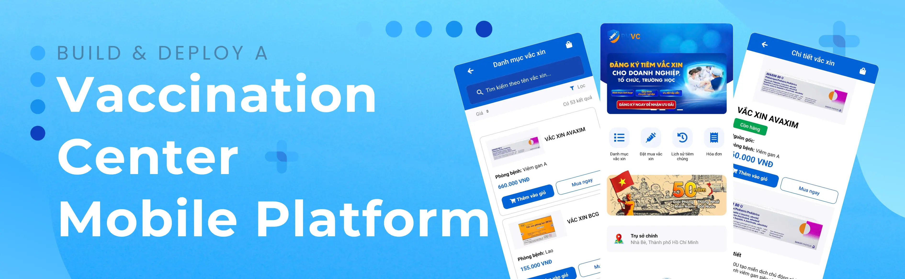

<div align="center">
  <br />
  
  <br /><br />

  <!-- Tech Stack Badges -->
  <p>
    
    
    
    
    
    
    
  </p>

  <h1>💉 Vaccination Center Management System</h1>

  <p>
    A full-stack mobile platform designed to manage vaccination records,
    appointments, healthcare workflows, and real-time communication between
    citizens and medical staff.
  </p>

  <p>
    <strong>Frontend & Realtime Chat</strong> by
    <a href="https://github.com/anhphapap">@anhphapap</a>
    &nbsp;•&nbsp;
    <strong>Backend</strong> by
    <a href="https://github.com/hoofdux243">@hoofdux243</a>
  </p>
</div>

---

## ✨ Introduction

**Vaccination Center** is a mobile-first healthcare management system built to
support vaccination programs at scale.  
The platform enables citizens to register and manage vaccination schedules,
medical staff to update vaccination records, and administrators to monitor
campaign performance through analytics.

The project focuses on **real-world healthcare workflows**, **secure data
management**, and **real-time interaction** using modern full-stack
technologies.

---

## 🔋 Core Features

### 👤 Citizens
- Register and manage personal profiles with photo upload
- View vaccination schedules and book appointments
- Receive appointment reminders via **email**
- Make vaccine payments through **VNPay**
- Download official **vaccination certificates**
- Track detailed **vaccination history** by vaccine type
- **Real-time chat** with healthcare staff using Firebase

### 🧑‍⚕️ Medical Staff
- Update vaccination status for each citizen
- Add medical notes and monitor post-vaccination reactions
- View complete vaccination history per user
- Communicate with citizens via **real-time chat**

### 🛡️ Administrators
- Manage citizen and medical staff accounts
- Manage vaccine data (create / update / delete)
- Create and monitor **community vaccination campaigns**
- Access analytics dashboards:
  - Number of vaccinated users
  - Vaccination completion rates
  - Most-used vaccine types by **month**, **quarter**, and **year**

---

## ⚙️ Tech Stack

| Layer            | Technology                                  |
| ---------------- | ------------------------------------------- |
| Mobile App       | React Native                                |
| Backend API      | Django + Django REST Framework              |
| Realtime Chat    | Firebase Realtime Database                  |
| Authentication   | OAuth 2                                     |
| Payments         | VNPay Integration                           |
| Background Jobs  | Redis + Celery                              |
| Email Service    | SendGrid                                   |

---

## 🤸 Quick Start

### Mobile App (React Native)
```bash
cd frontend
npm install
npx expo start
```

### Backend (Django)
```bash
cd backend
python -m venv env
source env/bin/activate
pip install -r requirements.txt

python manage.py migrate
python manage.py runserver
```

---

## 🔗 API Configuration
```js
const BASE_URL = "http://<your-local-ip>:8000/api/";
```

> When testing on a physical device, replace `localhost` with your machine’s local IP address.

---

## 👥 Contributors

| Name          | Role       | GitHub                                       |
| ------------- | ---------- | -------------------------------------------- |
| Pham Anh Pha  | Frontend   | [@anhphapap](https://github.com/anhphapap)   |
| Nguyen Ho Vu  | Backend    | [@hoofdux243](https://github.com/hoofdux243) |
